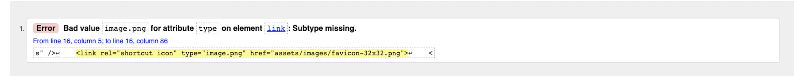
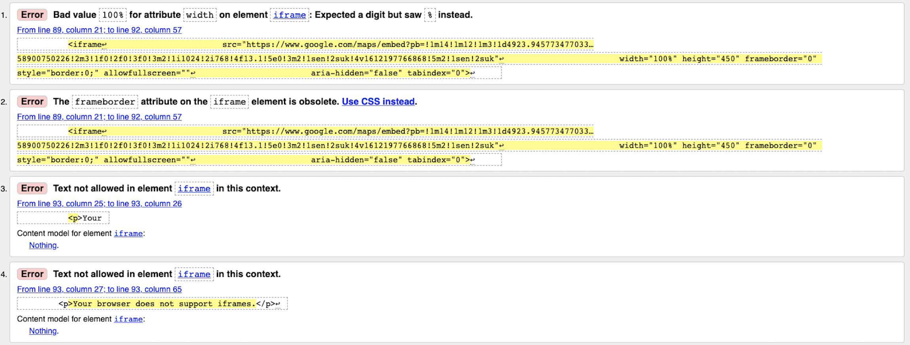
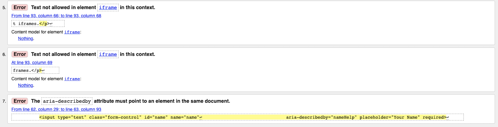
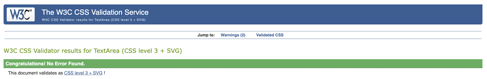
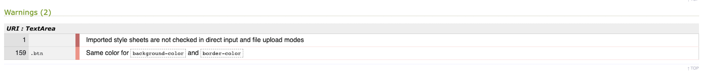
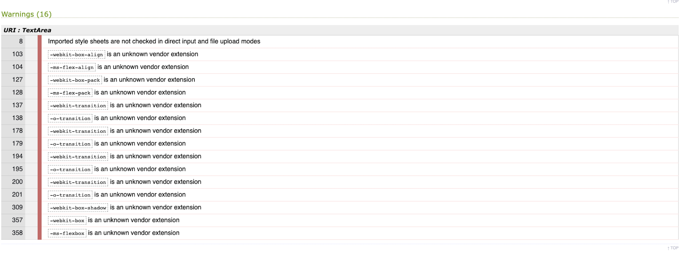

# Lucky Dog - Testing details

[Back to README.md file](README.md)

[Live Website](https://mosull20.github.io/lucky-dog-ms1/)

### Code Validation

1. HTML Validated on [W3C Markup Validation Service](https://validator.w3.org/)
    * Home page - 1 error 
    - Solution found via W3 schools - syntax changed to "image/png". After this amendment, code was run through again and passed with no errors.
    * Services page - no errors found 
    * Team page - no errors found
    * Contact page - 7 errors found  
    - Solution - error 1 - adjusted the width to replace the % value that was there.
    - Solution - error 2 - deleted frameborder attribute as this is now obsolete, researched this on google, included `border: none;` in css as recommended.
    - Solution - errors 3,4,5,6 - found on Slack community, this text can now be removed as iframes are now supported and instead a "title" attribute is used which I then added. 
    - Solution - error 7 - changed the aria-describedby value to "name" to link it to the id name.
    - After implementing these solutions, I ran the code through the validator again and it passed with no further errors.

2. CSS Validated on [Jigsaw W3C CSS Validation Service](https://jigsaw.w3.org/css-validator/) 
    * Passed with no errors found 
    * Two warnings were found 
    * Solution - no action required on first warning as the @import content cannot be checked. Re the second warning, I removed border-color style rule from style.css 
    as it was unnecessary.

    * NOTE: the above was done before running my css file through the autoprefixer resource. After, I ran it again through the Validator and got the following warnings. 
    
    * After checking this on the Slack community, I understand these warnings do not require action.

### Manual Testing

### User stories Testing

### Bugs & Fixes

* Wireframe issues - problems linking to wireframes from this file so I moved the wireframes folder from assets to root level, re-exported the original wireframes from Balsamiq 
and re-loaded to the wireframes folder. Content of wireframes not changed from original during this process. 

