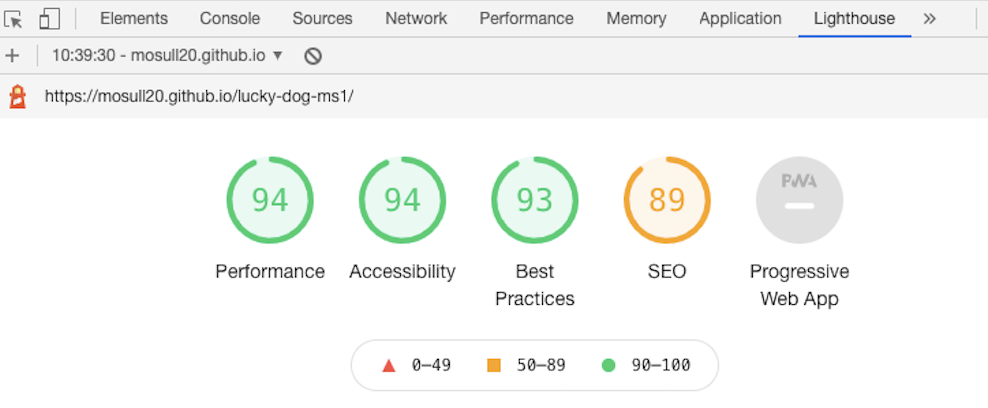

# Lucky Dog - Testing details

[Back to README.md file](README.md)

[Live Website](https://mosull20.github.io/lucky-dog-ms1/)

### Code Validation

1. HTML Validated on [W3C Markup Validation Service](https://validator.w3.org/)
    * Home page - 1 error 
    - Solution found via W3 schools - syntax changed to "image/png". After this amendment, code was run through again and passed with no errors.
    * Services page - no errors found 
    * Team page - no errors found
    * Contact page - 7 errors found  
    - Solution - error 1 - adjusted the width to replace the % value that was there.
    - Solution - error 2 - deleted frameborder attribute as this is now obsolete, researched this on google, included `border: none;` in css as recommended.
    - Solution - errors 3,4,5,6 - found on Slack community, this text can now be removed as iframes are now supported on all browsers,
    and instead a "title" attribute is used which I then added. I double checked this for myself on [Can I Use.com](https://caniuse.com/?search=iframe)
    and followed a link from there to [MDN Webdocs](https://developer.mozilla.org/en-US/docs/Web/HTML/Element/iframe#browser_compatibility).
    - Solution - error 7 - changed the aria-describedby value to "name" to link it to the id name.
    - After implementing these solutions, I ran the code through the validator again and it passed with no further errors.

2. CSS Validated on [Jigsaw W3C CSS Validation Service](https://jigsaw.w3.org/css-validator/) 
    * Passed with no errors found 
    * Two warnings were found 
    * Solution - no action required on first warning as the @import content cannot be checked. Re the second warning, I removed border-color style rule from style.css 
    as it was unnecessary.

    * NOTE: the above was done before running my css file through the autoprefixer resource. After, I ran it again through the Validator and got the following warnings. 
    
    * After checking this on the Slack community, I understand these warnings do not require action.

### Manual Testing

#### Lighthouse testing

* Tested each page at mobile size and desktop size and got the following results

+ Home page - mobile

+ Home page - desktop

+ Services page - mobile

+ Services page - desktop

+ Team page - mobile

+ Team page - desktop

+ Contact page - mobile

+ Contact page - desktop

___

#### Functionality testing

I used [Google Chrome DevTools](https://developers.google.com/web/tools/chrome-devtools) continuously throughout the project to check how every detail worked, 
particularly with regard to checking responsiveness of each feature as I worked on them. 

Here are the steps taken in testing the website is now functional.

**__Home page__**
+ Nav Bar: 
  - clicked on paw print logo - re-loads the home page
  - clicked on Home link at right hand side - reloads home page
  - clicked on Our Services link - brings user to services.html page
  - clicked on Meet the Team link - brings user to team.html page
  - clicked on Contact Us link - brings user to contact.html page
  - checked the nav menu links collapse into hamburger icon at mobile level and when selected it drops down the links menu
  - Scroll down to visually check the Nav Bar is sticky and remains visible at top of page while scrolling down

+ Content section:
  - clicked on link at end of first paragraph - brings user to team.html page as expected
  - clicked on Get in Touch link in second paragraph - brings user to contact page as expected
  - clicked on Contact us link in third paragraph - brings user to contact page as expected
  - read through all content again to check for typo's or any other content errors. Two found at this stage and I corrected them. 
  - checked overall responsiveness by using Chrome dev tools to view it on mobile and tablet size devices
  - checked images for responsiveness and ensure they hold a good relative, proportional size at each screen size and do not get squashed 
or stretched when at different screen sizes.

+ Footer section:
  - clicked on Get in Touch link - brings user to contact page as expected
  - clicked on each social media link to ensure it brings the user to social media pages that open in a new browser window, all performed as expected

**__Services page__**
+ Repeated all the above steps re the Nav Bar and Footer to ensure those links all work as expected on this page
+ Content section:
  - clicked on each of the four contact buttons to ensure they each linked correctly - all bring the user to the contact page
  - checked responsiveness of the page overall on each screen size in DevTools
  - checked responsiveness of images within each box to ensure they retained their original proportion at each screen size and performed as expected

**__Team page__**
+ Repeated all steps above re Nav Bar and Footer, to ensure all links work from this page. Found the Get in Touch link in the footer did not lead 
the user to the contact page as I had not replaced the placeholder for the href attribute so I corrected this. 
+ Content section 
  - clicked on contact us button - brings user to the contact page
  - checked all image and text at various screen sizes to ensure all in proportion 

**__Contact page__**
+ Repeated all steps above re Nav Bar and Footer to ensure all links work. All work correctly.

+ Contact form: 
  - clicked send it button with no input anywere in the form, it ask user to fill in name field, tried again with no email input, 
form correctly rejects it and prompts user to enter email. Phone number field is optional so it will send with this blank, This is intentional. 
Tried sending with no input in message area and it will correctly prompt user to fill in this field. Once all complete, action of send it will open 
the CI form dump page in a new broswer window, as intended.
+ Embedded google map: 
  - works as expected, with the google maps buttons contained opening a larger map in a new broswer window, or enlarging the map in its container.

____

#### Responsiveness

* Checked the project's responsiveness at [Responsinator.com](http://www.responsinator.com/)

#### Cross Browser Testing

I checked the website on the following broswers - Chrome, Firefox, Safari, Opera and Microsoft Edge and all displayed and functioned as intended. 

___

### User stories Testing

* _As a user of this website, I want to find out what the business does and what services they provide._

On the home page, the first section of content describes a short summary of what this business does and the services provided. The navigation links at the top of the page show
a link to click on 'Our Services' which brings the user to the Services page which has full details here.

* _As a user, I want to find out in what geographical areas are services available._

The heading and content on the home page emphasise this business provides dog walking services all around the Cork city area. 

* _As a user, I want to be reassured they will keep my dog safe._

On the home page, content descibes how all walkers are animal first aid qualified with a link here to the detailed team page for further info.

* _As a user, I want to find out what people who have used the business have said about it._

On the home page, there is a 'client testimonials' section with reviews of the business from previous clients.

* _As a user, I want to find out who the dog walkers are and what experience they have with dogs._

The navigation menu provides a link to the 'Meet the team' page. Here it details each of our walkers previous experience with dogs and any qualifications they hold 
relating to animal care.

* _As a user, I want to know how much it will cost me to employ a dog walker through this business._

The navigation menu provides a link to 'Our Services' page which details the pricing structure, including options for regular, weekly walks and monthly options.

* _As a user, I want to be able to easily find out how to contact the business if I want more information or have more questions._ 

Throughout the site there are multiple links to encourage the user to go to the contact page and send an enquiry. The navigation menu provides a clear link to 'Contact us' page,
The home page content under the first heading also contains a link to 'get in touch' which will lead the user to the contact page. The footer also contains a clear 'Get in Touch' link
which will open the contact page. The services page also has a contact us button under each option, these open the contact page. Another link is contained in a button on the team page,
clearly marked contact us. On the contact page, there is a simple short form to submit with your message and a Send it button underneath. 
Note: no phone number or business address is listed here as this is a fictional business designed solely for the purpose of the MS1 project for Code Institute. 

* _As a user, I want to be able to easily find out what the next step is if I wish to book a walk._ 

On the pricing page, there is a contact button to lead the user to the contact page to fill out the message form. As noted, a feature to implement at a future date would be an online booking
system so user can book directly on the website. This would give the user a better experience but it is currently outside the scope of this project. 

* _As a user, I want to find out if there is a package of recurring walks and if this is more cost effective for me._

The pricing system is clearly and simply laid out in box format on the Services page and shows the value of booking weekly or monthly.

* _As a user, I want to be able to follow them on social media for the very latest updates._

Social Media links are in the footer section with the icon for each social media platform as a link that will open these in a new browser window to ensure the user can easily come back to
the Lucky dog website.
___

### Bugs & Fixes

* Wireframe issues - problems linking to wireframes from this file so I moved the wireframes folder from assets to root level, re-exported the original wireframes from Balsamiq 
and re-loaded to the wireframes folder. Content of wireframes not changed from original during this process. 

* Had issues when using the bootstrap 'fixed-top' class for the navbar that it was blocking content at the top of the page. I found a solution to this on [Stack Overflow](https://stackoverflow.com/questions/10336194/top-nav-bar-blocking-top-content-of-the-page) after a google
search led me there. This solution consisted of adding padding to the body and using media queries to adjust it for each breakpoint as necessary. 

* Had issues with the bootstrap collapsed menu icon re targeting it for styling, on googling the issue, I saw a suggestion on [Stack Overflow](https://stackoverflow.com/questions/42586729/bootstrap-4-change-hamburger-toggler-color) about using a font-awesome hamburger icon 
instead to make styling easier. This is the approach I adopted to get the results I wanted. 

* On initial Lighthouse testing, SEO was reading at 81, one opportunity it highlighted to improve this was to add metadata tags.
I then added the meta tage with description, keywords and author. This improved the SEO to the above result.
Lighthouse also gave me the opportunity to spot that I had not gone in sequential order with my h tags so I amended this and it also
helped to improve the accessibilty from an initial reading of 88.

* Using Chrome DevTools, I noticed my original color choice (a lighter shade of orange/red) showed a poor contrast ratio which would make the text less legible so using the color picker
feature in DevTools, I was able to improve this to a more accessible, deeper shade for better contrast. 

